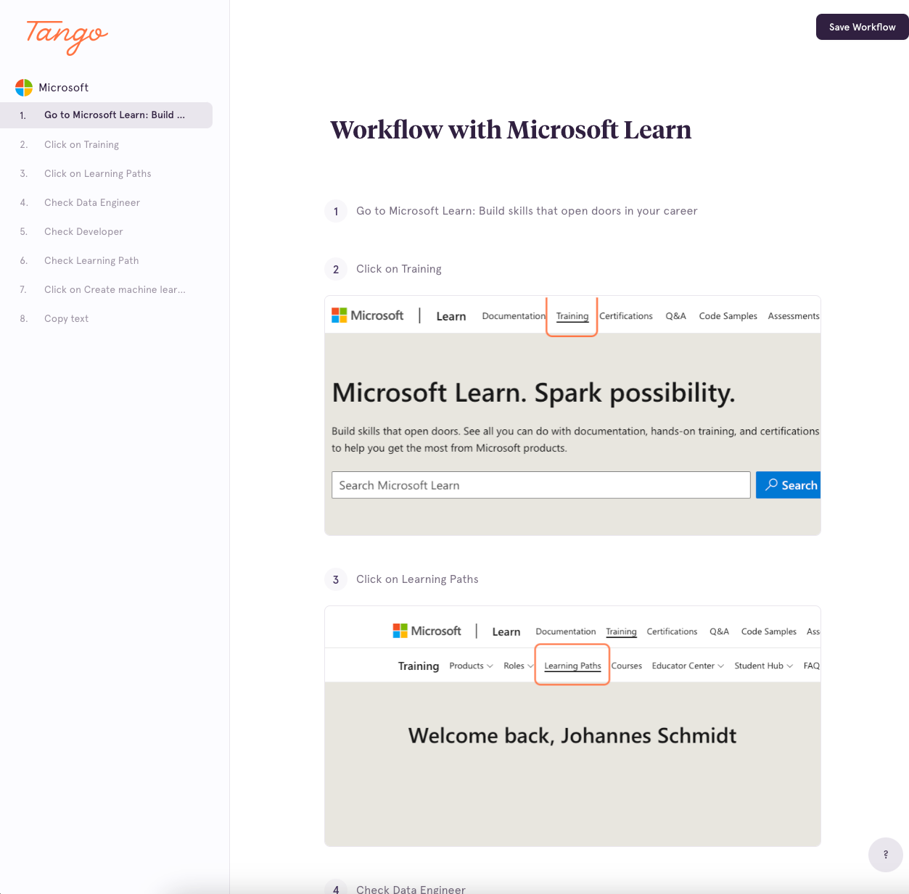
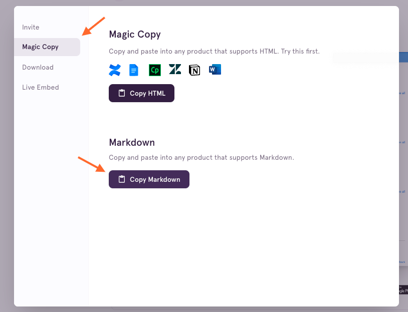

# Tango process markdown

This script allows to postprocess the markdown file.

## Getting started

### 1. Get the [Tango Chrome Extension](https://chrome.google.com/webstore/detail/tango-screenshots-trainin/lggdbpblkekjjbobadliahffoaobaknh)

More details at [tango.us](https://www.tango.us/).

### 2. Create a Tango account


### 3. Start recording your step-by-step workflow


### 4. View the results and start editing

Editing is optional, but allows to zoom in/out, add rectangles, add arrows or add/modify text.




Finish editing by clicking **Save Workflow**.

### 5. Copy the markdown to your clipboard

- Click on **Share & Export** and select **Magic Copy**.
- Click on **Copy Markdown** to copy the content to your clipboard.



### 6. Run the script

```shell
python3 process_markdown.py tutorial_processed.md --header "How to find the Learning Path: 'Create machine learning models'"
```

### 7. View the processed [result](./tutorial_processed.md) and compare it to the [unprocessed result](./tutorial_unprocessed.md)
