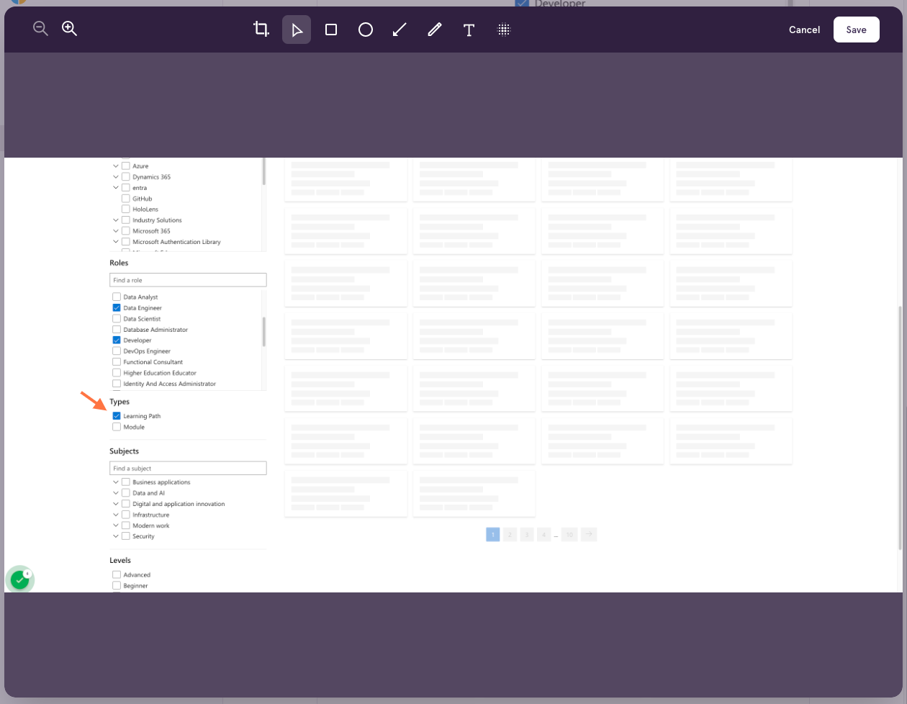

# Tango process markdown

This script is designed to **post-process markdown text** generated by **Tango**.

It **removes the watermark** and **other unnecessary content**, and **downloads images** so that they can be used
locally.

## Table of contents

<!-- TOC -->
* [Tango process markdown](#tango-process-markdown)
  * [Table of contents](#table-of-contents)
  * [Minimal example](#minimal-example)
  * [Installation](#installation)
  * [Getting started](#getting-started)
    * [1. Get the Tango Chrome Extension](#1-get-the-tango-chrome-extension)
    * [2. Create a Tango account](#2-create-a-tango-account)
    * [3. Start recording your step-by-step workflow](#3-start-recording-your-step-by-step-workflow)
    * [4. View the results and start editing](#4-view-the-results-and-start-editing)
    * [5. Copy the markdown to your clipboard](#5-copy-the-markdown-to-your-clipboard)
    * [6. Run the script](#6-run-the-script)
    * [7. View the OUTPUT and compare it to the UNPROCESSED RESULT](#7-view-the-output-and-compare-it-to-the-unprocessed-result)
  * [Help](#help)
  * [TODO:](#todo-)
<!-- TOC -->

## Minimal example

You can save the markdown text to a file and specify the file path when running the script.
For example:

```bash
python3 src/tango_process_markdown/process_markdown.py --markdown-file example_unprocessed.md
```

Or you can copy the markdown text to your clipboard and run the script with the `--clipboard` flag.
For example:

```bash
python3 my_script.py --clipboard
```

## Installation

Create and activate a virtual environment and install the required packages with:

```shell
poetry install --no-root
```

OR

```shell
pip install .
```

## Getting started

### 1. Get the [Tango Chrome Extension](https://chrome.google.com/webstore/detail/tango-screenshots-trainin/lggdbpblkekjjbobadliahffoaobaknh)

More details at [tango.us](https://www.tango.us/).

### 2. Create a Tango account


### 3. Start recording your step-by-step workflow


### 4. View the results and start editing

Editing is optional, but allows to zoom in/out, add rectangles, add arrows or add/modify text.




Finish editing by clicking **Save Workflow**.

### 5. Copy the markdown to your clipboard

- Click on **Share & Export** and select **Magic Copy**.
- Click on **Copy Markdown** to copy the content to your clipboard.


### 6. Run the script

```shell
python3 src/tango_process_markdown/process_markdown.py --clipboard --image-dir images --header "How to use Tango like a Pro: 'Example'" --output example_processed.md
```

### 7. View the [OUTPUT](example_processed.md) and compare it to the [UNPROCESSED RESULT](example_unprocessed.md)

<div style="display:flex;flex-wrap:wrap">
    <div style="flex:50%;padding:5px;">
        <h3 style="font-size:20px;text-align:center">Unprocessed image</h3>
        
    </div>
    <div style="flex:50%;padding:5px;">
        <h3 style="font-size:20px;text-align:center">Processed image</h3>
        
    </div>
</div>

## Help

If you have troubles, run:

```shell
python3 src/tango_process_markdown/process_markdown.py --help
```

## TODO:

- [ ] Make async calls instead of sync
- [ ] Add unit tests
- [ ] Create GitHub Page
- [ ] Setup CI
