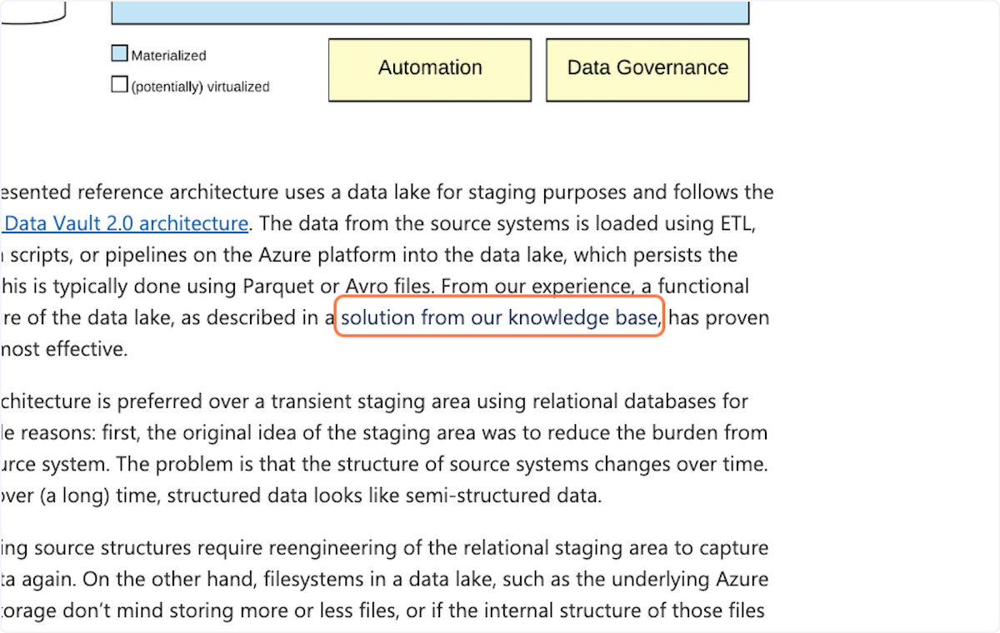

# How to use Tango like a Pro: 'Example'

### 1. [Go to www.microsoft.com](https://www.microsoft.com/en-ca/industry/blog/azure/2023/03/14/data-vault-2-0-on-the-databricks-lakehouse/?utm_source=LinkedIn&utm_medium=feed&utm_campaign=MicrosoftBlog4)

### 2. Click on hybrid Data Vault 2.0 architecture

### 3. Click on solution from our knowledge base

### 4. [Go to scalefree.attach.io](https://scalefree.attach.io/mX4g2BiHR?utm_source=Microsoft+Azure+Blog&utm_medium=referral&utm_campaign=dv_azure_blog)

