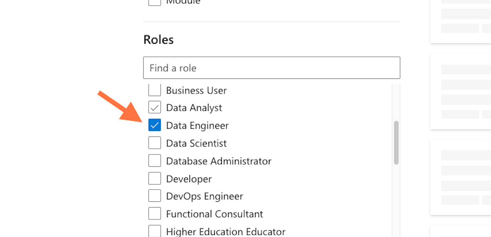
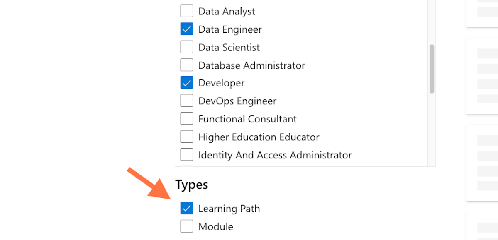
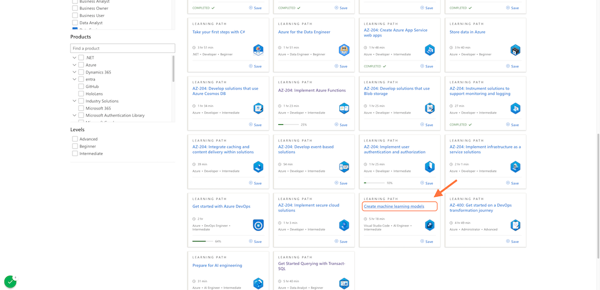

# How to find the Learning Path: 'Create machine learning models'

### 1. [Go to Microsoft Learn: Build skills that open doors in your career](https://learn.microsoft.com/en-us/)

### 2. Click on Training

### 3. Click on Learning Paths

### 4. Check Data Engineer

### 5. Check Developer

### 6. Check Learning Path

### 7. Click on Create machine learning models

